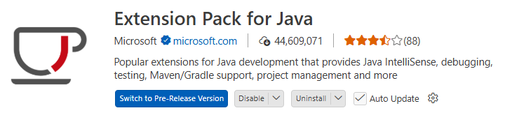

# 01. (PC기반)SpringAI_실습_VSCode_OpenAI_React_Cloud

# **Spring AI (Step by Step)**

VS Code 개발 환경부터 OpenAI 연동, React 프론트엔드, 클라우드 배포까지

| **대상** | Java와 Spring Boot 기초를 학습한 입문자 |
| --- | --- |
| **기준 환경** | Java 21, Spring Boot 3.5.15, Spring AI 1.1.8, Maven |
| **구현 결과** | OpenAI 기반 한국어 AI 튜터 웹 서비스 |
| **배포 구성** | Render 백엔드, Vercel 프론트엔드 |
- 기준일: 2026년 6월 22일
- 실습 예제 소스: spring-ai-step-by-step-source.zip

# **제0장. 교재 사용 안내**

이 교재는 처음부터 끝까지 한 프로젝트를 완성하는 방식으로 구성했습니다. 각 단계의 명령어, 파일 위치, 확인 방법을 함께 제시합니다.

## **0.1 학습 대상과 선수 지식**

Java 문법과 HTTP, JSON의 기초를 알고 있다면 따라갈 수 있습니다. Spring Boot 경험이 많지 않아도 괜찮습니다. 다만 클래스, 메서드, 생성자 주입의 의미는 먼저 익혀 두는 편이 좋습니다.

- Java 17 이상 문법을 읽을 수 있는 학습자
- REST API와 JSON의 기본 개념을 알고 있는 학습자
- VS Code에서 터미널과 파일 탐색기를 사용할 수 있는 학습자
- GitHub 계정, OpenAI API 계정, Render 계정, Vercel 계정을 준비할 수 있는 학습자

## **0.2 이 교재에서 완성할 결과**

최종 결과는 질문을 입력하면 OpenAI 모델의 답변을 보여 주는 웹 서비스입니다. 프론트엔드는 React와 Vite로 만들고, 백엔드는 Spring Boot와 Spring AI로 구성합니다.

| **구성 요소** | **역할** | **실행 위치** |
| --- | --- | --- |
| React/Vite | 질문 입력, 응답 표시, 오류 안내 | 브라우저, Vercel |
| Spring Boot REST API | 입력 검증, CORS, 오류 처리 | 로컬 PC, Render |
| Spring AI ChatClient | 프롬프트 구성, OpenAI 모델 호출 | Spring Boot 내부 |
| OpenAI API | LLM 응답 생성 | OpenAI 클라우드 |

## **0.3 버전 선택 원칙**

2026년 6월 기준 최신 Spring AI 안정판은 2.0.0이지만, 2.0 계열은 Spring Boot 4.0 또는 4.1을 전제로 합니다. 이 교재는 Spring Boot 3.5 기반 교육과 기존 프로젝트에 쉽게 적용할 수 있도록 Spring AI 1.1.8을 사용합니다. Spring AI 1.1 공식 문서는 Spring Boot 3.4와 3.5를 지원한다고 명시합니다.

| **항목** | **교재 기준** | **선정 이유** |
| --- | --- | --- |
| Java | 21 | 장기 지원 버전이며 Spring Boot 3.5 실습에 적합 |
| Spring Boot | 3.5.15 | 3.5 계열의 안정 패치 버전 |
| Spring AI | 1.1.8 | Spring Boot 3.4, 3.5 지원, Maven Central 배포 |
| OpenAI 모델 | gpt-4o-mini | 입문 실습에 적당한 기본 모델, 환경 변수로 변경 가능 |
| 프론트엔드 | React 19, Vite 7 | 간단한 SPA와 REST 연동 실습에 적합 |

**버전 주의**

Spring Initializr에서 생성되는 버전은 시점에 따라 달라질 수 있습니다. 교재의 pom.xml과 예제 소스를 기준으로 맞춘 뒤 진행하세요.

### Eclipse Temurin JDK 21 (권장)

~~현재 Dev Container 기반 실습환경에서는 PC나 MacBook에 Java 21을 따로 설치하지 않아도 됩니다.~~ Spring AI 자체를 이해하고 디버깅 하려면 Windows PC에도 Java 21을 설치하는 것을 권장합니다.

Windows에서 Spring AI와 Spring Boot 개발용이라면 **Eclipse Temurin JDK 21 LTS**를 가장 추천합니다.

공식 다운로드 페이지

[**Eclipse Temurin JDK 21 다운로드**](https://adoptium.net/temurin/releases/?version=21&utm_source=chatgpt.com)

다운로드 옵션 (Windows 기준)

- Operating System : **Windows**
- Architecture : **x64**
- Package Type : **JDK**
- Version : **21 (LTS)**

### 설치 확인

```powershell
PS: user010> java --version
openjdk 21.0.11 2026-04-21 LTS
OpenJDK Runtime Environment Temurin-21.0.11+10 (build 21.0.11+10-LTS)
OpenJDK 64-Bit Server VM Temurin-21.0.11+10 (build 21.0.11+10-LTS, mixed mode, sharing)
PS: user010>
```

---

# **0.4 검증 항목**

| **검증 항목** | **확인 결과** | **근거** |
| --- | --- | --- |
| Spring AI 1.1 호환 범위 | Spring Boot 3.4.x, 3.5.x 지원 | Spring AI 1.1 Getting Started |
| OpenAI 스타터 | spring-ai-starter-model-openai | Spring AI OpenAI Chat Reference |
| API 키 속성 | spring.ai.openai.api-key | Spring AI OpenAI Chat Reference |
| ChatClient 기본 호출 | prompt → user → call → content | Spring AI Chat Client API |
| Render 포트 | 0.0.0.0과 PORT 환경 변수 사용 | Render Web Services |
| Vite 환경 변수 | VITE_ 접두사는 브라우저 번들에 포함 | Vercel Vite 문서 |

**API 비용**

ChatGPT 구독과 OpenAI API 사용료는 별도입니다. API 플랫폼에서 결제 수단과 사용 한도를 따로 설정해야 합니다.

---

# 제1장. Spring AI와 실습 구조 이해

코드를 작성하기 전에 Spring AI가 맡는 역할과 이번 프로젝트의 요청 흐름을 먼저 확인합니다.

| 구분 | 내용 |
| --- | --- |
| 학습 목표 | Spring AI의 역할을 설명한다.프론트엔드와 백엔드의 책임을 구분한다.API 키를 백엔드에만 두어야 하는 이유를 이해한다. |
| 완료 결과 | 브라우저에서 OpenAI까지 이어지는 전체 호출 흐름을 설명할 수 있다. |

## 1.1 Spring AI란 무엇인가

Spring AI는 Java와 Spring Boot 애플리케이션에서 생성형 AI 모델을 일관된 방식으로 다룰 수 있게 해 주는 프레임워크입니다.

모델 업체마다 다른 HTTP 요청 형식을 직접 구현하지 않아도 됩니다. Spring AI가 제공하는 `ChatClient`, `ChatModel`, 프롬프트, 구조화 출력, 도구 호출, RAG 같은 공통 API를 사용할 수 있습니다.

이번 실습에서는 가장 단순한 텍스트 대화부터 시작합니다. 사용자의 질문을 Spring Boot가 받고, `ChatClient`가 OpenAI 모델에 전달한 뒤, 결과를 JSON으로 반환합니다.

## 1.2 ChatModel과 ChatClient의 차이

| 구분 | ChatModel (개념만 확인) | ChatClient (주요 구현 API) |
| --- | --- | --- |
| 성격 | 모델 호출을 직접 다루는 저수준 API | 프롬프트 흐름을 간결하게 작성하는 상위 API |
| 적합한 상황 | 요청과 응답 메타데이터를 세밀하게 제어할 때 | 일반 대화, Advisor, RAG, 도구 호출을 연결할 때 |

### ChatClient의 기본 동기 호출

```java
String answer = chatClient.prompt()
        .user("Spring AI를 쉽게 설명해 줘.")
        .call()
        .content();
```

## 1.3 전체 구조 먼저 보기

이 교재는 브라우저, React 프론트엔드, Spring Boot 백엔드, OpenAI API를 분리해서 구성합니다.

API 키는 백엔드에만 둡니다. 프론트엔드는 백엔드 REST API만 호출합니다.

```
사용자 브라우저
    ↓
React Vite 프론트엔드
    ↓
Spring Boot 백엔드
    ↓
Spring AI ChatClient
    ↓
OpenAI API
```

각 구성 요소의 역할은 다음과 같습니다.

| 구성 요소 | 역할 |
| --- | --- |
| React | 질문을 JSON으로 전송하고 답변을 화면에 표시한다. |
| Spring Boot | 입력값을 검사하고 Spring AI `ChatClient`로 모델을 호출한다. |
| OpenAI API 키 | 서버 환경 변수에 저장한다. 브라우저 코드나 Git 저장소에 넣지 않는다. |
| 클라우드 배포 | 백엔드는 Render, 프론트엔드는 Vercel에 배포한다. |

## 1.4 요청과 응답의 실제 흐름

① 사용자가 React 화면에서 질문을 입력합니다.

② React가 `/api/chat`으로 JSON 요청을 보냅니다.

```
POST /api/chat
Content-Type: application/json
```

```json
{
  "message": "Spring AI가 무엇인지 설명해 줘."
}
```

③ Spring Boot가 질문이 비어 있지 않은지 검사합니다.

④ `ChatService`가 `ChatClient`로 OpenAI 모델을 호출합니다.

⑤ 백엔드가 다음 형식의 JSON을 반환합니다.

```json
{
  "answer": "Spring AI는 Spring 애플리케이션에서 생성형 AI 모델을 쉽게 사용할 수 있게 해 주는 프레임워크입니다."
}
```

⑥ React가 답변을 대화 화면에 추가합니다.

---

# 제2장. VS Code 개발 환경 구축

Windows와 macOS에서 공통으로 사용할 수 있는 Java, Maven, VS Code 환경을 준비합니다.

| 구분 | 내용 |
| --- | --- |
| 학습 목표 | Java 21과 Maven을 설치한다.VS Code의 Java와 Spring 확장팩을 설치한다.터미널에서 버전과 경로를 확인한다. |
| 완료 결과 | `java`, `javac`, `mvn` 명령이 정상 실행되고 VS Code에서 Spring Boot 프로젝트를 열 수 있습니다. |

## 2.1 준비 프로그램

| 프로그램 | 권장 기준 | 확인 명령 |
| --- | --- | --- |
| JDK | Java 21 | `java -version`, `javac -version` |
| Maven | 3.9 이상 | `mvn -version` |
| VS Code | 현재 안정판 | `code --version` |
| Node.js | 22 LTS 권장 | `node -v`, `npm -v` |
| Git | 현재 안정판 | `git --version` |

## 2.2 Java 21 설치

### ① JDK 배포판 선택

Temurin, Oracle JDK, Microsoft Build of OpenJDK 중 하나를 설치합니다. 실습에서는 Java 21을 사용합니다.

### ② 설치 확인

공통 확인 명령은 다음과 같습니다.

```bash
java -version
```

```bash
javac -version
```

출력에 `21`이 표시되어야 합니다. 다른 버전이 나오면 `PATH` 또는 `JAVA_HOME`이 이전 JDK를 가리키고 있는지 확인합니다.

### ③ JAVA_HOME 확인

Windows PowerShell에서는 다음 명령을 사용합니다.

```powershell
$env:JAVA_HOME
```

```powershell
Get-Command java
```

- macOS 또는 Linux에서는 다음 명령을 사용합니다.
    
    ```bash
    echo $JAVA_HOME
    ```
    
    ```bash
    which java
    ```
    
    macOS에서는 설치된 JDK 목록을 다음 명령으로 확인할 수 있습니다.
    
    ```bash
    /usr/libexec/java_home -V
    ```
    

### Apple Silicon

M2, M3, M4, M5 Mac은 `arm64`용 JDK를 설치하는 편이 좋습니다. `x64` JDK도 Rosetta로 동작할 수 있지만 실습 환경을 단순하게 유지하려면 칩 아키텍처에 맞추세요.

## 2.3 Maven 설치

### ① Windows

`winget`, Chocolatey 또는 Maven 공식 압축 파일을 사용합니다.

winget 사용 예는 다음과 같습니다. (Powershell)

```powershell
winget install Apache.Maven
```

새 터미널에서 설치 여부를 확인합니다.

```powershell
mvn -version
```

### ② macOS

Homebrew가 설치되어 있다면 다음 명령을 사용합니다.

```bash
brew install maven
```

설치 여부를 확인합니다.

```bash
mvn -version
```

`mvn -version` 결과에는 Maven 버전과 실제 사용 중인 Java 버전이 함께 표시됩니다. Java 21이 아닌 경우 `JAVA_HOME`을 먼저 수정합니다.

---

## 참고: Windows에 Maven 수동 설치하기 (압축 해제, Path 경로 추가)

`winget`, Chocolatey 로 설치가 잘 안된다면 직접 압축파일을 받아서 설치 할 수 있습니다. (가장 확실함)

① Apache Maven의 **Binary zip archive**를 다운로드합니다.

② 압축을 다음과 같이 풉니다.

```
C:\apache-maven-3.9.x
```

③ 시스템 환경 변수에 다음 항목을 추가합니다.

```
변수 이름: MAVEN_HOME
변수 값: C:\apache-maven-3.9.x
```

④ 시스템 변수 `Path`에 다음 경로를 추가합니다.

```
%MAVEN_HOME%\bin
```

⑤ PowerShell이나 VS Code를 다시 실행한 후 확인합니다.

```powershell
mvn -v
```

Maven 버전이 출력되면 설치가 완료된 것입니다.

Spring Boot 프로젝트는 `pom.xml`이 있는 폴더에서 실행합니다.

```powershell
mvn spring-boot:run
```

---

## 2.4 VS Code와 확장팩 설치

① VS Code를 설치하고 실행합니다.

② 왼쪽 Extensions 아이콘을 엽니다.

③ Extension Pack for Java를 검색해 설치합니다.

④ Spring Boot Extension Pack을 검색해 설치합니다.

⑤ 필요하면 REST Client를 추가해 HTTP 요청을 편리하게 테스트합니다.



| 확장팩 | 주요 기능 |
| --- | --- |
| Extension Pack for Java | 코드 완성, 디버깅, Maven, 테스트 실행 |
| Spring Boot Extension Pack | Spring Initializr, Boot Dashboard, Spring 속성 지원 |
| REST Client (선택) | VS Code 안에서 `.http` 파일로 REST API 호출 |


---

### REST Client 사용

① Spring Boot 애플리케이션을 실행합니다.

```bash
mvn spring-boot:run
```

또는 VS Code의 **Run** 버튼을 클릭하여 실행합니다.

② `test.http` 파일을 생성합니다.

③ HTTP 요청을 작성합니다.

**GET 요청**

```
GET http://localhost:8080
```

**POST 요청**

```
POST http://localhost:8080/api/chat
Content-Type: application/json

{
  "message": "Spring AI를 설명해 주세요."
}
```

④ 요청 위에 표시되는 **Send Request**를 클릭합니다.

⑤ 응답 결과를 확인합니다.

---

## 2.5 작업 폴더 만들기

Windows PowerShell에서는 다음 명령을 사용합니다.

```powershell
mkdir C:\spring-ai-workspace
```

```powershell
cd C:\spring-ai-workspace
```

```powershell
code .
```

- macOS 또는 Linux에서는 다음 명령을 사용합니다.
    
    ```bash
    mkdir -p ~/spring-ai-workspace
    ```
    
    ```bash
    cd ~/spring-ai-workspace
    ```
    
    ```bash
    code .
    ```
    

## 2.6 VS Code 상태 확인

VS Code Extensions에 **Spring Boot Extension Pack이 설치 되었다면 다음 단계를 진행 해서 Spring boot 프로젝트를 생성 합니다.**

프로젝트를 처음 열면 Java Language Server가 인덱싱을 시작합니다. 상태 표시줄의 `Java Ready`가 확인되기 전에는 빨간 밑줄이 일시적으로 나타날 수 있습니다. `pom.xml`을 수정한 뒤에는 Maven 프로젝트 새로 고침이 필요합니다.

### 문제 해결

Java 프로젝트가 계속 인식되지 않으면 Command Palette에서 다음 명령을 실행하고 VS Code를 다시 엽니다.

Ctrl + Shift + P

```
Java: Clean Java Language Server Workspace
```


```powershell
Spring Initializr: Create a Maven Project
```


→ 3.5.15 → Java → com.example → backend→ com.example.demo→ Jar → 21

다음 항목을 검색해서 선택

```powershell
Spring Web
Validation
Spring Boot Actuator
OpenAI
```


## 실습 점검

```
□ java -version이 21을 표시한다.
□ mvn -version이 정상 출력된다.
□ VS Code에서 Java와 Spring Boot 확장팩이 활성화되어 있다.
```

---

### JAVA_HOME이 VS Code에 설정된 이전 경로로 표시될 때

① `Ctrl + Shift + P`를 누른 뒤 `Preferences: Open Workspace Settings (JSON)`을 실행한다.

② `.vscode/settings.json`에 다음 내용을 작성한다.

```json
{
  "java.jdt.ls.java.home": "C:\\Program Files\\Eclipse Adoptium\\jdk-21.0.11.10-hotspot",
  "terminal.integrated.env.windows": {
    "JAVA_HOME": "C:\\Program Files\\Eclipse Adoptium\\jdk-21.0.11.10-hotspot",
    "PATH": "C:\\Program Files\\Eclipse Adoptium\\jdk-21.0.11.10-hotspot\\bin;${env:PATH}"
  }
}
```

③ VS Code 터미널을 새로 열고 확인한다.

```bash
echo %JAVA_HOME%
java -version
```

④ 그래도 반영되지 않으면 관리자 권한 명령 프롬프트(CMD)에서 실행한다.

- 관리자 권한 실행이 아닌 CMD에서는 ‘/M’ 옵션을 빼야 합니다.

```bash
setx JAVA_HOME "C:\Program Files\Eclipse Adoptium\jdk-21.0.11.10-hotspot" /M
```

PowerShell에서

```jsx
$env:JAVA_HOME
java -version
```

설정 후 VS Code를 완전히 종료하고 다시 실행한다.

---

# **제3장. Spring Boot 프로젝트 생성과 기본 실행**

OpenAI를 연결하기 전에 서버가 정상적으로 실행되고 REST API가 응답하는지 먼저 확인합니다.

| **학습 목표** | - Spring Initializr 설정을 선택한다.
- 프로젝트 구조와 pom.xml을 확인한다.
- 기본 REST API를 실행하고 테스트한다. |
| --- | --- |
| **완료 결과** | GET /api/hello가 JSON으로 응답합니다. |

## **3.1 Spring Initializr 설정**

VS Code의 Command Palette에서 Spring Initializr: Create a Maven Project를 선택해도 되고, start.spring.io에서 ZIP 파일을 받아도 됩니다. 예제 소스를 그대로 사용할 경우 이 절의 생성 과정은 비교용으로 읽고 넘어가도 됩니다.

| **항목** | **선택값** |
| --- | --- |
| Project | Maven |
| Language | Java |
| Spring Boot | 3.5.x |
| Group | com.example |
| Artifact | spring-ai-tutorial |
| Packaging | Jar |
| Java | 21 |
| Dependencies | Spring Web, Validation, Actuator, OpenAI |

**① 프로젝트 생성** 생성된 폴더를 VS Code로 엽니다.

**② 예제 소스와 버전 맞추기** pom.xml을 열어 Spring Boot 3.5.15와 Spring AI 1.1.8을 확인합니다.

**backend/pom.xml**

```xml
<?xml version="1.0" encoding="UTF-8"?>

<project xmlns="http://maven.apache.org/POM/4.0.0"
         xmlns:xsi="http://www.w3.org/2001/XMLSchema-instance"
         xsi:schemaLocation="http://maven.apache.org/POM/4.0.0 https://maven.apache.org/xsd/maven-4.0.0.xsd">

    <modelVersion>4.0.0</modelVersion>

    <parent>
        <groupId>org.springframework.boot</groupId>
        <artifactId>spring-boot-starter-parent</artifactId>
        <version>3.5.15</version>
        <relativePath/>
    </parent>

    <groupId>com.example</groupId>
    <artifactId>spring-ai-tutorial</artifactId>
    <version>0.0.1-SNAPSHOT</version>
    <name>spring-ai-tutorial</name>
    <description>Spring AI and OpenAI step-by-step tutorial</description>

    <properties>
        <java.version>21</java.version>
        <spring-ai.version>1.1.8</spring-ai.version>
    </properties>

    <dependencyManagement>
        <dependencies>
            <dependency>
                <groupId>org.springframework.ai</groupId>
                <artifactId>spring-ai-bom</artifactId>
                <version>${spring-ai.version}</version>
                <type>pom</type>
                <scope>import</scope>
            </dependency>
        </dependencies>
    </dependencyManagement>

    <dependencies>
        <dependency>
            <groupId>org.springframework.boot</groupId>
            <artifactId>spring-boot-starter-web</artifactId>
        </dependency>

        <dependency>
            <groupId>org.springframework.boot</groupId>
            <artifactId>spring-boot-starter-validation</artifactId>
        </dependency>

        <dependency>
            <groupId>org.springframework.boot</groupId>
            <artifactId>spring-boot-starter-actuator</artifactId>
        </dependency>

        <dependency>
            <groupId>org.springframework.ai</groupId>
            <artifactId>spring-ai-starter-model-openai</artifactId>
        </dependency>

        <dependency>
            <groupId>org.springframework.boot</groupId>
            <artifactId>spring-boot-starter-test</artifactId>
            <scope>test</scope>
        </dependency>
    </dependencies>

    <build>
        <plugins>
            <plugin>
                <groupId>org.springframework.boot</groupId>
                <artifactId>spring-boot-maven-plugin</artifactId>
            </plugin>
        </plugins>
    </build>

</project>
```

---

## **3.2 프로젝트 구조**

backend/

```
backend/
├─ pom.xml
├─ Dockerfile
└─ src/
   ├─ main/
   │  ├─ java/
   │  │  └─ com/
   │  │     └─ example/
   │  │        └─ demo/
   │  │           ├─ SpringAiTutorialApplication.java
   │  │           ├─ config/
   │  │           │  └─ CorsConfig.java
   │  │           ├─ controller/
   │  │           │  └─ ChatController.java
   │  │           ├─ dto/
   │  │           │  ├─ ChatRequest.java
   │  │           │  └─ ChatResponse.java
   │  │           ├─ error/
   │  │           │  └─ GlobalExceptionHandler.java
   │  │           └─ service/
   │  │              └─ ChatService.java
   │  └─ resources/
   │     └─ application.yml
   └─ test/
      └─ java/
         └─ com/
            └─ example/
               └─ demo/
```

---

패키지는 역할별로 나누었습니다. controller는 HTTP 요청을 받고, service는 AI 호출을 담당하며, dto는 요청과 응답 형식을 정의합니다. config와 error는 운영에 필요한 공통 설정을 맡습니다.

## **3.3 환경 변수 없이 기본 서버 확인하기**

현재 pom.xml에는 OpenAI 스타터가 포함되어 있어 API 키가 없으면 전체 애플리케이션 기동이 실패할 수 있습니다. 따라서 실제 실행 전에 제4장의 OPENAI_API_KEY 설정까지 먼저 마칩니다. 기본 REST API 코드는 다음과 같습니다.

**ChatController의 기본 확인 엔드포인트**

```java
@GetMapping("/hello")
public Map<String, String> hello() {
	return Map.of("message", "Spring AI 서버가 실행 중입니다.");
}

```

**참고: OpenAI 라이브러리가 추가 되었다면 다음 설정을 [application.properties](http://application.properties) 파일에 api-key 속성을 설정하고 OPENAI_API_KEY 환경변수를 시스템에 등록 합니다 (자세한 설명은 아래 4장 참조).**

---

## 3.4 서버 실행

### ① 터미널 위치 확인

`backend` 폴더에서 실행합니다.

```bash
cd backend
```

```bash
mvn spring-boot:run
```

### ② 로그 확인

다음 내용을 확인합니다.

```
Started SpringAiTutorialApplication
```

서버 포트는 `8080`입니다.

### ③ 브라우저 또는 curl로 확인

```bash
curl http://localhost:8080/api/hello
```

정상 응답 예시는 다음과 같습니다.

```json
{
  "message": "Spring AI 서버가 실행 중입니다."
}
```

## 3.5 Maven 명령 정리

| 명령 | 용도 |
| --- | --- |
| `mvn spring-boot:run` | 개발 중 애플리케이션 실행 |
| `mvn test` | 테스트 실행 |
| `mvn clean package` | 기존 산출물 삭제 후 JAR 생성 |
| `java -jar target/*.jar` | 빌드된 JAR 실행 |
| `mvn dependency:tree` | 의존성 충돌 확인 |

## 실습 점검

```
□ pom.xml 버전을 확인했다.
□ 서버 로그에서 8080 포트를 확인했다.
□ GET /api/hello가 JSON을 반환한다.
```

---

# 제4장. OpenAI API 연동

API 키를 안전하게 설정하고 `ChatClient`로 첫 번째 모델 응답을 받아 봅니다.

| 구분 | 내용 |
| --- | --- |
| 학습 목표 | OpenAI API 키와 결제 구조를 이해한다.API 키를 환경 변수로 설정한다.
`ChatClient` 기반 서비스와 REST API를 구현한다.오류 상태를 구분하고 대응한다. |
| 완료 결과 | `POST /api/chat` 요청에 OpenAI 모델의 답변이 JSON으로 반환됩니다. |

## 4.1 API 계정과 비용 확인

ChatGPT Plus, Pro, Business 구독과 OpenAI API는 별도 서비스입니다. ChatGPT를 구독하고 있어도 API 플랫폼의 결제 수단, 프로젝트, 사용 한도를 따로 설정해야 합니다. 실습 전에는 낮은 예산 한도와 사용 알림을 먼저 정하는 편이 안전합니다.

① OpenAI API 플랫폼에 로그인합니다.

② 실습 전용 프로젝트를 만듭니다.

③ Billing에서 결제 수단과 사용 한도를 확인합니다.

④ API Keys에서 프로젝트 키를 생성합니다.

⑤ 키는 생성 직후 안전한 비밀 저장소에 보관합니다.

### 중요

API 키 전체 값은 다시 표시되지 않을 수 있습니다. 화면 캡처, 수업 자료, 메신저, Git 저장소에 남기지 마세요.

## 4.2 OPENAI_API_KEY 설정

### ① Windows PowerShell에서 현재 터미널에만 설정(CMD 아님)

```powershell
$env:OPENAI_API_KEY="발급한_API_키"
$env:OPENAI_MODEL="gpt-4o-mini"
```

값 존재 여부만 확인합니다.

```powershell
if ($env:OPENAI_API_KEY) { "OPENAI_API_KEY 설정됨" }
```

---

### ② macOS 또는 Linux에서 현재 터미널에만 설정

```bash
export OPENAI_API_KEY="발급한_API_키"
export OPENAI_MODEL="gpt-4o-mini"
```

값 전체를 출력하지 않고 존재 여부만 확인합니다.

```bash
[ -n "$OPENAI_API_KEY" ] && echo "OPENAI_API_KEY 설정됨"
```

현재 터미널에 설정한 값은 터미널을 닫으면 사라집니다. 수업 PC에서는 이 방식이 오히려 안전합니다. 장기 저장이 필요하면 운영체제의 비밀 저장 기능이나 배포 플랫폼의 환경 변수 기능을 사용합니다.

## 4.3 application.yml 작성

**backend/src/main/resources/application.yml**

```yaml
server:
  address: 0.0.0.0
  port: ${PORT:8080}

spring:
  application:
    name: spring-ai-tutorial
  ai:
    openai:
      api-key: ${OPENAI_API_KEY}
      chat:
        options:
          model: ${OPENAI_MODEL:gpt-4o-mini}

management:
  endpoints:
    web:
      exposure:
        include: health,info
  endpoint:
    health:
      probes:
        enabled: true

app:
  cors:
    allowed-origins: ${APP_CORS_ALLOWED_ORIGINS:http://localhost:5173}
```

`${OPENAI_API_KEY}`는 환경 변수에서 값을 읽습니다. 모델 이름은 `${OPENAI_MODEL:gpt-4o-mini}`로 설정했으므로 `OPENAI_MODEL`이 없으면 `gpt-4o-mini`를 사용합니다. API 키에는 기본값을 두지 않습니다.

### 모델 옵션

추론 모델과 일반 채팅 모델은 지원하는 옵션이 다릅니다. 모델을 바꾼 뒤 400 오류가 발생하면 `temperature`, `maxTokens` 같은 옵션을 먼저 제거하고 해당 모델 문서를 확인하세요.

## 4.4 요청과 응답 DTO

**ChatRequest.java**

```java
package com.example.demo.dto;

import jakarta.validation.constraints.NotBlank;
import jakarta.validation.constraints.Size;

public record ChatRequest(
        @NotBlank(message = "질문을 입력해 주세요.")
        @Size(max = 2000, message = "질문은 2,000자 이내로 입력해 주세요.")
        String message
) {
}
```

**ChatResponse.java**

```java
package com.example.demo.dto;

public record ChatResponse(String answer) {
}
```

`record`는 단순한 데이터 전달 객체를 간결하게 표현합니다. `@NotBlank`는 빈 문자열을 막고, `@Size`는 지나치게 긴 입력을 제한합니다. 이 검사는 비용과 오용을 줄이는 첫 단계입니다.

## 4.5 ChatService 구현

**ChatService.java**

```java
package com.example.demo.service;

import org.springframework.ai.chat.client.ChatClient;
import org.springframework.stereotype.Service;

@Service
public class ChatService {

    private final ChatClient chatClient;

    public ChatService(ChatClient.Builder chatClientBuilder) {
        this.chatClient = chatClientBuilder
                .defaultSystem("""
                        당신은 Spring AI 입문자를 돕는 한국어 튜터입니다.
                        질문의 핵심부터 설명하고, 필요한 경우 짧은 예제를 덧붙이세요.
                        확인되지 않은 내용은 단정하지 마세요.
                        """)
                .build();
    }

    public String ask(String message) {
        return chatClient.prompt()
                .user(message)
                .call()
                .content();
    }
}
```

생성자에서 자동 구성된 `ChatClient.Builder`를 주입받습니다. `defaultSystem`은 모든 질문에 공통으로 적용할 역할과 응답 규칙입니다. `ask` 메서드는 사용자의 질문을 전달하고 최종 텍스트만 반환합니다.

## 4.6 REST 컨트롤러 구현

**ChatController.java**

```java
package com.example.demo.controller;

import com.example.demo.dto.ChatRequest;
import com.example.demo.dto.ChatResponse;
import com.example.demo.service.ChatService;
import jakarta.validation.Valid;
import org.springframework.http.ResponseEntity;
import org.springframework.web.bind.annotation.GetMapping;
import org.springframework.web.bind.annotation.PostMapping;
import org.springframework.web.bind.annotation.RequestBody;
import org.springframework.web.bind.annotation.RequestMapping;
import org.springframework.web.bind.annotation.RestController;

import java.util.Map;

@RestController
@RequestMapping("/api")
public class ChatController {

    private final ChatService chatService;

    public ChatController(ChatService chatService) {
        this.chatService = chatService;
    }

    @GetMapping("/hello")
    public Map<String, String> hello() {
        return Map.of("message", "Spring AI 서버가 실행 중입니다.");
    }

    @PostMapping("/chat")
    public ResponseEntity<ChatResponse> chat(@Valid @RequestBody ChatRequest request) {
        String answer = chatService.ask(request.message());
        return ResponseEntity.ok(new ChatResponse(answer));
    }
}
```

`@Valid`가 `ChatRequest`의 검증 규칙을 실행합니다. 입력이 올바르면 `ChatService`를 호출하고, 응답을 `ChatResponse`로 감싸 JSON으로 반환합니다.

## 4.7 첫 번째 AI 호출 테스트

### ① 백엔드 실행

```bash
cd backend
```

```bash
mvn spring-boot:run
```

실행 결과

```powershell
[INFO] --- spring-boot:3.5.15:run (default-cli) @ demo ---
[INFO] Attaching agents: []

  .   ____          _            __ _ _
 /\\ / ___'_ __ _ _(_)_ __  __ _ \ \ \ \
( ( )\___ | '_ | '_| | '_ \/ _` | \ \ \ \
 \\/  ___)| |_)| | | | | || (_| |  ) ) ) )
  '  |____| .__|_| |_|_| |_\__, | / / / /
 =========|_|==============|___/=/_/_/_/

 :: Spring Boot ::               (v3.5.15)

2026-06-23T23:26:01.357+09:00  INFO 17744 --- [demo] [           main] com.example.demo.DemoApplication         : Starting DemoApplication using Java 21.0.11 with PID 17744 (C:\spring-ai-workspace2026\spring-ai-proj01\demo\target\classes started by beomj in C:\spring-ai-workspace2026\spring-ai-proj01\demo)
```

### /hello GET 요청

```bash
# 요청
curl http://localhost:8080/api/hello

# 요청 결과
{"message":"Spring AI 서버가 실행 중입니다."}
```

### ② 새 터미널에서 POST 요청

```bash
curl -X POST http://localhost:8080/api/chat -H "Content-Type: application/json" -d "{\"message\":\"Spring AI를 초보자에게 세 문장으로 설명해 줘.\"}"
```

응답 예시는 다음과 같습니다.

```json
{
  "answer": "Spring AI는 Spring Boot에서 생성형 AI 모델을 쉽게 연결하도록 돕는 프레임워크입니다. ..."
}
```

PowerShell에서 `curl` 대신 `Invoke-WebRequest` 별칭 사용.

PowerShell에서는 이렇게 실행하세요.

```powershell
$body = @{
    message = "Spring AI를 초보자에게 세 문장으로 설명해 줘."
} | ConvertTo-Json

Invoke-RestMethod `
    -Uri "http://localhost:8080/api/chat" `
    -Method Post `
    -ContentType "application/json; charset=utf-8" `
    -Body $body
```

또는 실제 curl을 쓰려면 `curl.exe`로 실행합니다.

```powershell
'{"message":"Spring AI를 초보자에게 세 문장으로 설명해 줘."}' |
    Set-Content -Path request.json -Encoding utf8

curl.exe -X POST "http://localhost:8080/api/chat" `
    -H "Content-Type: application/json; charset=utf-8" `
    --data-binary "@request.json"
```

## 4.8 오류 처리

**GlobalExceptionHandler.java**

```java
package com.example.demo.error;

import org.slf4j.Logger;
import org.slf4j.LoggerFactory;
import org.springframework.http.HttpStatus;
import org.springframework.http.ResponseEntity;
import org.springframework.web.bind.MethodArgumentNotValidException;
import org.springframework.web.bind.annotation.ExceptionHandler;
import org.springframework.web.bind.annotation.RestControllerAdvice;

import java.time.Instant;

@RestControllerAdvice
public class GlobalExceptionHandler {

    private static final Logger log =
            LoggerFactory.getLogger(GlobalExceptionHandler.class);

    @ExceptionHandler(MethodArgumentNotValidException.class)
    public ResponseEntity<ApiError> handleValidation(
            MethodArgumentNotValidException exception
    ) {
        String message = exception.getBindingResult()
                .getFieldErrors()
                .stream()
                .findFirst()
                .map(error -> error.getDefaultMessage() == null
                        ? "입력값을 확인해 주세요."
                        : error.getDefaultMessage())
                .orElse("입력값을 확인해 주세요.");

        return ResponseEntity.badRequest().body(
                new ApiError(
                        Instant.now(),
                        HttpStatus.BAD_REQUEST.value(),
                        message
                )
        );
    }

    @ExceptionHandler(Exception.class)
    public ResponseEntity<ApiError> handleUnexpected(Exception exception) {
        log.error("AI 요청 처리 중 오류가 발생했습니다.", exception);

        return ResponseEntity.status(HttpStatus.INTERNAL_SERVER_ERROR).body(
                new ApiError(
                        Instant.now(),
                        HttpStatus.INTERNAL_SERVER_ERROR.value(),
                        "AI 요청을 처리하지 못했습니다. 서버 로그와 API 설정을 확인해 주세요."
                )
        );
    }
}
```

| 증상 | 가능한 원인 | 확인 순서 |
| --- | --- | --- |
| 401 Unauthorized | API 키 누락, 오타, 폐기된 키 | 환경 변수, 프로젝트 키 상태 확인 |
| 429 Too Many Requests | 크레딧 부족, 사용 한도, 요청 과다 | Billing, Limits, 재시도 간격 확인 |
| 400 Bad Request | 모델 옵션 불일치, 잘못된 모델명 | `OPENAI_MODEL`과 옵션 제거 후 재시도 |
| model_not_found | 계정에서 사용할 수 없는 모델 | 공식 모델 목록과 프로젝트 권한 확인 |
| Connection timeout | 네트워크, 프록시, 방화벽 | 회사망 정책과 외부 접속 확인 |
| 500 응답 | 백엔드 내부 예외 | Spring Boot 로그의 원인 예외 확인 |

현재 코드에 맞는 `ApiError` 클래스가 필요합니다. 다음 파일을 만드세요.

```
src/main/java/com/example/demo/error/ApiError.java
```

파일 구조는 다음과 같습니다.

```
error
├─ ApiError.java
└─ GlobalExceptionHandler.java
```

```java
package com.example.demo.error;

import java.time.Instant;

public record ApiError(
        Instant timestamp,
        int status,
        String message
) {
}
```

`GlobalExceptionHandler`에서 다음 세 값을 전달하고 있기 때문에 `ApiError`도 동일한 구조여야 합니다.

```java
new ApiError(
        Instant.now(),
        HttpStatus.BAD_REQUEST.value(),
        message
)
```

## 4.9 API 키가 Git에 들어가지 않게 하기

**.gitignore**

```
.env
.env.*
!.env.example
*.log
```

커밋 전에 확인합니다.

```bash
git status
```

```bash
git diff --cached
```

### 이미 커밋했다면

파일만 삭제하는 것으로 끝나지 않습니다. 키를 즉시 폐기하고 새 키를 발급한 뒤, 저장소 이력 노출 범위를 별도로 점검하세요.

## 실습 점검

```
□ 환경 변수에 API 키를 설정했다.
□ POST /api/chat이 answer JSON을 반환한다.
□ 빈 질문이 400 오류로 처리된다.
□ API 키가 소스와 Git 기록에 없는지 확인했다.
```

실행 결과

```powershell
PS C:\Users\beomj> Invoke-RestMethod `
>>   -Uri "http://localhost:8080/api/chat" `
>>   -Method POST `
>>   -ContentType "application/json; charset=utf-8" `
>>   -Body (@{ message = "Spring AI를 초보자에게 세 문장으로 설명해 줘." } | ConvertTo-Json)

answer
------
Spring AI는 Spring 프레임워크에서 인공지능 기능을 통합하여 개발할 수 있게 도와주는 모듈입니다. 이를 통해 머신러닝 모델…

PS C:\Users\beomj>
```

---

# 제5장. React/Vite 프론트엔드 연동

브라우저에서 질문을 입력하고 Spring Boot API의 답변을 표시하는 화면을 만듭니다.

| 구분 | 내용 |
| --- | --- |
| 학습 목표 | Vite 기반 React 프로젝트를 만든다.
`fetch`로 `POST /api/chat`을 호출한다.
로딩과 오류 상태를 화면에 표시한다.
로컬 프록시와 CORS의 차이를 이해한다. |
| 완료 결과 | `http://localhost:5173`에서 질문을 전송하고 AI 답변을 확인합니다. |

## 5.1 React 프로젝트 생성

```bash
cd spring-ai-step-by-step-source
```

```bash
npm create vite@latest frontend -- --template react
```

```bash
cd frontend
```

```bash
npm install
```

```bash
npm run dev
```

예제 ZIP에는 `frontend` 폴더가 이미 들어 있습니다. 직접 생성하는 실습을 할 때는 Vite가 만든 기본 파일을 예제 소스의 `App.jsx`, `index.css`, `vite.config.js`로 교체합니다.

## 5.2 프론트엔드 파일 구조

```
frontend/
├─ package.json
├─ vite.config.js
├─ index.html
├─ .env.example
└─ src/
   ├─ main.jsx
   ├─ App.jsx
   └─ index.css
```

## 5.3 로컬 개발 프록시

**frontend/vite.config.js**

```jsx
import { defineConfig } from 'vite'
import react from '@vitejs/plugin-react'

export default defineConfig({
  plugins: [react()],
  server: {
    port: 5173,
    proxy: {
      '/api': {
        target: 'http://localhost:8080',
        changeOrigin: true
      }
    }
  }
})
```

로컬에서는 React가 `5173` 포트, Spring Boot가 `8080` 포트에서 실행됩니다. Vite 프록시는 브라우저가 `/api` 요청을 보내면 개발 서버가 이를 `http://localhost:8080`으로 전달합니다. 이 방식은 로컬 CORS 문제를 줄여 줍니다.

## 5.4 App.jsx 구현

**App.jsx: 상태와 API 호출**

```jsx
import { useState } from 'react'

const API_BASE_URL = (import.meta.env.VITE_API_BASE_URL || '').replace(/\/$/, '')

function App() {
  const [question, setQuestion] = useState('Spring AI를 한 문단으로 설명해 줘.')
  const [messages, setMessages] = useState([])
  const [loading, setLoading] = useState(false)
  const [error, setError] = useState('')

  const submitQuestion = async (event) => {
    event.preventDefault()

    const trimmed = question.trim()

    if (!trimmed || loading) return

    setError('')
    setLoading(true)
    setMessages((current) => [...current, { role: 'user', text: trimmed }])
    setQuestion('')

    try {
      const response = await fetch(`${API_BASE_URL}/api/chat`, {
        method: 'POST',
        headers: { 'Content-Type': 'application/json' },
        body: JSON.stringify({ message: trimmed }),
      })

      const data = await response.json().catch(() => ({}))

      if (!response.ok) {
        throw new Error(data.message || `요청 실패: HTTP ${response.status}`)
      }

      setMessages((current) => [
        ...current,
        { role: 'assistant', text: data.answer || '응답 내용이 없습니다.' },
      ])
    } catch (requestError) {
      setError(
        requestError instanceof Error
          ? requestError.message
          : '알 수 없는 오류가 발생했습니다.'
      )
    } finally {
      setLoading(false)
    }
  }

  return (
    <main className="page-shell">
      <section className="chat-card">
        <header>
          <p className="eyebrow">SPRING AI STEP BY STEP</p>
          <h1>Spring AI 튜터</h1>
          <p className="subtitle">
            React에서 Spring Boot REST API를 거쳐 OpenAI 모델을 호출합니다.
          </p>
        </header>

        <div className="message-list" aria-live="polite">
          {messages.length === 0 && (
            <div className="empty-state">
              질문을 입력하고 첫 번째 AI 응답을 확인해 보세요.
            </div>
          )}

          {messages.map((message, index) => (
            <article
              key={`${message.role}-${index}`}
              className={`message ${message.role}`}
            >
              <strong>{message.role === 'user' ? '나' : 'AI'}</strong>
              <p>{message.text}</p>
            </article>
          ))}

          {loading && <div className="loading">답변을 작성하고 있습니다.</div>}
        </div>

        {error && <p className="error-box">{error}</p>}

        <form onSubmit={submitQuestion}>
          <label htmlFor="question">질문</label>
          <textarea
            id="question"
            value={question}
            onChange={(event) => setQuestion(event.target.value)}
            maxLength={2000}
            rows={4}
            placeholder="Spring AI에 관해 질문해 보세요."
          />

          <div className="form-footer">
            <span>{question.length}/2000</span>
            <button type="submit" disabled={loading || !question.trim()}>
              {loading ? '요청 중' : '질문 보내기'}
            </button>
          </div>
        </form>
      </section>
    </main>
  )
}

export default App
```

## 5.5 핵심 코드 읽기

```jsx
const API_BASE_URL = (import.meta.env.VITE_API_BASE_URL || '')
  .replace(/\/$/, '')
```

```jsx
const response = await fetch(`${API_BASE_URL}/api/chat`, {
  method: 'POST',
  headers: { 'Content-Type': 'application/json' },
  body: JSON.stringify({ message: trimmed }),
})
```

로컬에서는 `VITE_API_BASE_URL`을 비워 두고 Vite 프록시를 사용합니다. 배포 환경에서는 Render 주소를 넣습니다. `replace`는 주소 끝의 슬래시를 제거해 `//api/chat` 형태가 되는 것을 막습니다.

## 5.6 프론트엔드 실행

### ① 백엔드 터미널

```bash
cd backend
```

```bash
mvn spring-boot:run
```

### ② 프론트엔드 터미널

```bash
cd frontend
```

```bash
npm install
```

```bash
npm run dev
```

### ③ 브라우저 확인

```
http://localhost:5173
```

브라우저에서 위 주소를 열고 질문을 전송합니다.

## 5.7 CORS 설정 이해

**CorsConfig.java**

```java
package com.example.demo.config;

import org.springframework.beans.factory.annotation.Value;
import org.springframework.context.annotation.Configuration;
import org.springframework.web.servlet.config.annotation.CorsRegistry;
import org.springframework.web.servlet.config.annotation.WebMvcConfigurer;

import java.util.Arrays;

@Configuration
public class CorsConfig implements WebMvcConfigurer {

    private final String[] allowedOrigins;

    public CorsConfig(
            @Value("${app.cors.allowed-origins:http://localhost:5173}") String allowedOrigins
    ) {
        this.allowedOrigins = Arrays.stream(allowedOrigins.split(","))
                .map(String::trim)
                .filter(origin -> !origin.isBlank())
                .toArray(String[]::new);
    }

    @Override
    public void addCorsMappings(CorsRegistry registry) {
        registry.addMapping("/api/**")
                .allowedOrigins(allowedOrigins)
                .allowedMethods("GET", "POST", "OPTIONS")
                .allowedHeaders("*")
                .allowCredentials(false)
                .maxAge(3600);
    }
}
```

Vite 프록시를 쓰지 않고 React에서 `http://localhost:8080`을 직접 호출하면 브라우저의 동일 출처 정책 때문에 CORS 허용이 필요합니다. 운영 환경에서는 Vercel 주소만 허용하고, 불필요한 와일드카드는 피합니다.

## 5.8 VITE_ 변수에 비밀값을 넣으면 안 되는 이유

Vite가 노출하는 `VITE_` 변수는 빌드 시점에 클라이언트 번들로 들어갑니다. 사용자는 개발자 도구와 JavaScript 파일에서 값을 확인할 수 있습니다.

`VITE_API_BASE_URL`은 공개 주소이므로 사용할 수 있지만 `OPENAI_API_KEY`는 넣으면 안 됩니다.

| 변수 | 프론트엔드 사용 | 이유 |
| --- | --- | --- |
| `VITE_API_BASE_URL` | 가능 | 공개되는 백엔드 기본 주소 |
| `VITE_APP_NAME` | 가능 | 화면 표시용 공개 값 |
| `VITE_OPENAI_API_KEY` | 금지 | 브라우저 번들에서 노출 |
| `OPENAI_API_KEY` | 백엔드에서만 사용 | 서버 비밀 정보 |

## 실습 점검

```
□ React 화면이 열린다.
□ 질문을 보내면 Network 탭에서 POST /api/chat을 확인할 수 있다.
□ 로딩 중 중복 전송이 막힌다.
□ 오류가 발생하면 사용자에게 메시지가 표시된다.
```

---

# 제6장. Docker로 백엔드 패키징

Render 배포에 앞서 Spring Boot 애플리케이션을 컨테이너 이미지로 구성합니다.

| 구분 | 내용 |
| --- | --- |
| 학습 목표 | 멀티 스테이지 Dockerfile을 이해한다.
환경 변수와 이미지의 역할을 구분한다.
로컬 Docker 실행과 헬스 체크를 수행한다. |
| 완료 결과 | 동일한 이미지를 로컬과 Render에서 실행할 준비가 끝납니다. |

## 6.1 Dockerfile 작성

**backend/Dockerfile**

```docker
FROM maven:3.9.11-eclipse-temurin-21 AS builder

WORKDIR /workspace

COPY pom.xml .

RUN mvn -B -q -DskipTests dependency:go-offline

COPY src ./src

RUN mvn -B -DskipTests package

FROM eclipse-temurin:21-jre

WORKDIR /app

COPY --from=builder /workspace/target/*.jar app.jar

EXPOSE 8080

ENTRYPOINT ["java", "-jar", "/app/app.jar"]
```

첫 번째 단계는 Maven과 JDK로 JAR를 빌드합니다. 두 번째 단계는 JRE만 포함한 실행 이미지를 만듭니다. 소스 코드와 빌드 도구를 최종 이미지에서 제외하므로 이미지가 단순해집니다.

## 6.2 이미지 빌드

```bash
cd backend
```

```bash
docker build -t spring-ai-tutorial:1.0 .
```

## 6.3 컨테이너 실행

macOS 또는 Linux에서는 다음 명령을 사용합니다.

```bash
docker run --rm \
  -p 8080:8080 \
  -e OPENAI_API_KEY="$OPENAI_API_KEY" \
  -e OPENAI_MODEL="gpt-4o-mini" \
  -e APP_CORS_ALLOWED_ORIGINS="http://localhost:5173" \
  spring-ai-tutorial:1.0
```

Windows PowerShell에서는 다음 명령을 사용합니다.

```powershell
docker run --rm `
  -p 8080:8080 `
  -e OPENAI_API_KEY="$env:OPENAI_API_KEY" `
  -e OPENAI_MODEL="gpt-4o-mini" `
  -e APP_CORS_ALLOWED_ORIGINS="http://localhost:5173" `
  spring-ai-tutorial:1.0
```

한 줄로 입력할 수도 있습니다.

```bash
docker run --rm -p 8080:8080 -e OPENAI_API_KEY="$OPENAI_API_KEY" -e OPENAI_MODEL="gpt-4o-mini" -e APP_CORS_ALLOWED_ORIGINS="http://localhost:5173" spring-ai-tutorial:1.0
```

## 6.4 헬스 체크

```bash
curl http://localhost:8080/actuator/health
```

정상 응답은 다음과 같습니다.

```json
{
  "status": "UP"
}
```

## 6.5 Docker 문제 해결

| 증상 | 원인 | 조치 |
| --- | --- | --- |
| 이미지 빌드 중 의존성 실패 | 네트워크, Maven Central 접속 | 프록시와 DNS 확인 후 재시도 |
| 컨테이너 즉시 종료 | API 키 누락, 애플리케이션 예외 | `docker logs` 또는 터미널 로그 확인 |
| 8080 접속 불가 | 포트 매핑 누락 | `-p 8080:8080` 확인 |
| Apple Silicon 이미지 문제 | 아키텍처가 다른 베이스 이미지 | 멀티 아키텍처 공식 이미지 사용 |

## 실습 점검

```
□ docker build가 성공한다.
□ 컨테이너에서 /actuator/health가 UP을 반환한다.
□ 이미지 안에 API 키를 COPY하지 않았다.
```

---

# 제7장. Render에 Spring Boot 백엔드 배포

GitHub 저장소의 `backend` 폴더를 Docker Web Service로 배포합니다.

| 구분 | 내용 |
| --- | --- |
| 학습 목표 | GitHub에 안전하게 소스를 올린다.
Render Docker Web Service를 만든다.
환경 변수와 헬스 체크를 설정한다.
배포 URL에서 REST API를 확인한다. |
| 완료 결과 | `https://서비스명.onrender.com/api/hello`와 `/actuator/health`가 응답합니다. |

## 7.1 배포 전 Git 점검

```bash
git status
```

```bash
git grep -n "sk-" || true
```

```bash
git add .
```

```bash
git commit -m "Add Spring AI tutorial application"
```

```bash
git push origin main
```

`git grep` 결과에 실제 API 키가 나오면 커밋하지 않습니다. `.env` 파일뿐 아니라 터미널 기록을 복사한 `README`, 캡처 이미지, 로그 파일도 확인합니다.

## 7.2 Render Web Service 만들기

① Render에 로그인하고 **New, Web Service**를 선택합니다.

② GitHub 저장소를 연결합니다.

③ Runtime은 **Docker**를 선택합니다.

④ Root Directory는 비워 둡니다.

⑤ Dockerfile Path는 다음과 같이 설정합니다.

```
backend/Dockerfile
```

⑥ Docker Build Context는 다음과 같이 설정합니다.

```
backend
```

⑦ Health Check Path는 다음과 같이 설정합니다.

```
/actuator/health
```

⑧ 환경 변수를 등록한 뒤 배포를 시작합니다.

## 7.3 Render 환경 변수

| 키 | 예시 값 | 비고 |
| --- | --- | --- |
| `OPENAI_API_KEY` | Render Secret에 입력 | 필수, 소스에 넣지 않음 |
| `OPENAI_MODEL` | `gpt-4o-mini` | 모델 변경 시 수정 |
| `APP_CORS_ALLOWED_ORIGINS` | `https://예정된-프론트.vercel.app` | 첫 배포 때 임시로 로컬 주소 추가 가능 |
| `PORT` | 설정하지 않아도 됨 | Render가 자동 제공 |

## 7.4 포트와 호스트 설정

```yaml
server:
  address: 0.0.0.0
  port: ${PORT:8080}
```

Render Web Service는 `0.0.0.0`에 바인딩해야 외부 요청을 받을 수 있습니다. Render가 제공하는 `PORT` 값을 사용하고, 로컬에서는 기본값 `8080`으로 실행합니다.

## 7.5 배포 로그 확인

- Docker Build가 Maven 의존성을 내려받는지 확인합니다.
- `Started SpringAiTutorialApplication` 로그를 확인합니다.
- 포트 감지와 Health Check 성공 여부를 확인합니다.
- API 키나 전체 환경 변수 값이 로그에 출력되지 않는지 확인합니다.

## 7.6 배포 후 테스트

```bash
curl https://YOUR-SERVICE.onrender.com/actuator/health
```

```bash
curl https://YOUR-SERVICE.onrender.com/api/hello
```

```bash
curl -X POST https://YOUR-SERVICE.onrender.com/api/chat \
  -H "Content-Type: application/json" \
  -d '{"message":"배포 테스트입니다. 한 문장으로 답해 줘."}'
```

## 7.7 render.yaml 선택 사용

**저장소 루트의 render.yaml**

```yaml
services:
  - type: web
    name: spring-ai-tutorial-api
    runtime: docker
    dockerfilePath: ./backend/Dockerfile
    dockerContext: ./backend
    healthCheckPath: /actuator/health
    envVars:
      - key: OPENAI_API_KEY
        sync: false
      - key: OPENAI_MODEL
        value: gpt-4o-mini
      - key: APP_CORS_ALLOWED_ORIGINS
        sync: false
```

Blueprint를 사용하면 반복 배포 설정을 코드로 남길 수 있습니다. `sync: false`인 값은 저장소에 값을 적지 않고 Render 화면에서 별도로 입력합니다.

## 실습 점검

```
□ Render URL의 /actuator/health가 UP을 반환한다.
□ POST /api/chat이 실제 AI 답변을 반환한다.
□ Render 로그에 API 키가 노출되지 않는다.
```

---

# 제8장. Vercel에 React 프론트엔드 배포

Vite 프로젝트를 Vercel에 올리고 Render 백엔드와 연결합니다.

| 구분 | 내용 |
| --- | --- |
| 학습 목표 | Vercel에 Vite 프로젝트를 배포한다.
`VITE_API_BASE_URL`을 설정한다.
백엔드 CORS Origin을 실제 Vercel 주소로 제한한다.
브라우저에서 전체 흐름을 검증한다. |
| 완료 결과 | 공개 Vercel URL에서 질문을 보내고 Render 백엔드의 AI 답변을 확인합니다. |

## 8.1 배포 순서가 중요한 이유

① Render 백엔드 주소를 먼저 확보합니다.

② Vercel에 `VITE_API_BASE_URL`로 Render 주소를 등록합니다.

③ Vercel 배포 후 확정된 프론트엔드 주소를 확인합니다.

④ Render의 `APP_CORS_ALLOWED_ORIGINS`를 Vercel 주소로 갱신합니다.

⑤ 백엔드를 재배포하고 최종 통합 테스트를 합니다.

## 8.2 Vercel 프로젝트 생성

① Vercel에 로그인하고 **Add New, Project**를 선택합니다.

② GitHub 저장소를 Import합니다.

③ Root Directory를 다음과 같이 지정합니다.

```
frontend
```

④ Framework Preset이 **Vite**인지 확인합니다.

⑤ Build Command와 Output Directory를 확인합니다.

```
Build Command: npm run build
Output Directory: dist
```

## 8.3 환경 변수 등록

Vercel 프로젝트의 Environment Variables에 다음 값을 등록합니다.

```
VITE_API_BASE_URL=https://YOUR-SERVICE.onrender.com
```

`VITE_API_BASE_URL`은 공개 주소입니다. Production, Preview, Development 중 적용할 환경을 선택합니다. 값을 바꾼 뒤에는 새 배포가 필요합니다.

### 비밀 정보 금지

Vercel의 `VITE_` 변수는 브라우저에서 읽을 수 있습니다. `OPENAI_API_KEY`는 Render에만 저장하세요.

## 8.4 Render CORS 갱신

Render의 환경 변수에 Vercel 주소를 등록합니다.

```
APP_CORS_ALLOWED_ORIGINS=https://your-project.vercel.app
```

커스텀 도메인과 Preview 배포를 함께 사용할 경우 필요한 Origin을 쉼표로 구분합니다.

```
APP_CORS_ALLOWED_ORIGINS=https://app.example.com,https://your-project.vercel.app
```

값 끝에는 슬래시를 붙이지 않습니다.

## 8.5 최종 통합 테스트

① Vercel URL을 시크릿 창에서 엽니다.

② 간단한 질문을 전송합니다.

③ 브라우저 개발자 도구의 Network에서 `/api/chat` 상태가 `200`인지 확인합니다.

④ Request Payload가 다음 형식인지 확인합니다.

```json
{
  "message": "질문 내용"
}
```

⑤ Response에 `answer` 필드가 있는지 확인합니다.

```json
{
  "answer": "AI 답변"
}
```

⑥ Render 로그에서 같은 시각의 요청을 확인합니다.

## 8.6 배포 오류 해결

| 브라우저 증상 | 확인할 곳 | 대표 조치 |
| --- | --- | --- |
| Failed to fetch | Vercel 환경 변수, Render 상태 | Render URL과 HTTPS 확인 후 재배포 |
| CORS 오류 | Render `APP_CORS_ALLOWED_ORIGINS` | Vercel Origin을 정확히 등록 |
| 404 `/api/chat` | `VITE_API_BASE_URL`, 경로 | 주소 끝 슬래시와 `/api/chat` 중복 확인 |
| 500 오류 | Render 로그 | OpenAI 키, 결제, 모델명 확인 |
| Vercel에 이전 주소 사용 | 배포 환경 변수 | 변수 변경 후 Redeploy |

## 실습 점검

```
□ Vercel 화면이 정상 표시된다.
□ Network에서 POST 요청이 200이다.
□ Render CORS가 필요한 Origin만 허용한다.
□ OpenAI API 키가 브라우저에 노출되지 않는다.
```

---

# 제9장. 운영 점검과 실무 보완

실습이 끝난 뒤 비용, 보안, 로깅, 장애 대응을 점검합니다.

| 구분 | 내용 |
| --- | --- |
| 학습 목표 | 운영 전에 필요한 최소 보안 항목을 점검한다.
API 비용과 요청 한도를 관리한다.
배포 이후 로그와 헬스 체크를 활용한다. |
| 완료 결과 | 수업용 예제를 공개 서비스로 확장할 때 필요한 보완 항목을 설명할 수 있습니다. |

## 9.1 운영 전 보안 체크리스트

- OpenAI API 키를 프로젝트별로 분리하고 정기적으로 교체합니다.
- 질문 길이와 요청 빈도를 제한합니다.
- CORS는 실제 프론트엔드 Origin만 허용합니다.
- 오류 응답에 스택 트레이스와 비밀값을 노출하지 않습니다.
- 사용자 입력과 모델 출력을 그대로 신뢰하지 않습니다.
- 공개 서비스에는 인증, 사용자별 쿼터, 악용 방지 정책을 추가합니다.

## 9.2 비용 관리

LLM 비용은 입력 토큰과 출력 토큰, 사용 모델에 따라 달라집니다. 입문 실습에서는 짧은 질문, 짧은 시스템 메시지, 작은 출력 길이로 시작합니다. 수업 중에는 한 프로젝트 키를 모든 수강생에게 공유하기보다 팀별 또는 개인별 프로젝트를 분리하는 편이 추적과 회수가 쉽습니다.

| 관리 항목 | 권장 방식 |
| --- | --- |
| 예산 | API 프로젝트의 월 한도와 알림 설정 |
| 모델 | 실습 목적에 맞는 비용 효율적인 모델 사용 |
| 입력 길이 | DTO 검증으로 최대 길이 제한 |
| 출력 길이 | 프롬프트와 모델 옵션으로 과도한 응답 제한 |
| 모니터링 | 프로젝트별 사용량과 오류율 정기 확인 |

## 9.3 로그 원칙

운영 로그에는 요청 시각, 처리 시간, HTTP 상태, 오류 유형 정도를 남깁니다. 전체 API 키, Authorization 헤더, 개인정보가 포함된 질문 원문은 기록하지 않습니다. 교육 환경에서도 학생이 입력한 민감정보가 로그에 남지 않도록 안내합니다.

## 9.4 다음 학습 순서

| 단계 | 확장 주제 | 선행 조건 |
| --- | --- | --- |
| 1 | 스트리밍 응답 | ChatClient 기본 호출, React `fetch` |
| 2 | PromptTemplate, 구조화 출력 | 프롬프트, DTO |
| 3 | 대화 기억 | 세션 또는 영속 저장소 |
| 4 | RAG | 문서 분할, 임베딩, 벡터 저장소 |
| 5 | Tool Calling | 함수 설계, 입력 검증 |
| 6 | MCP | 클라이언트와 서버 전송 방식 |
| 7 | 관측성과 평가 | 메트릭, 추적, 품질 기준 |

### 권장 순서

처음부터 RAG와 Agent를 한 프로젝트에 모두 넣지 않는 것이 좋습니다. 기본 대화 API가 안정적으로 동작한 뒤 스트리밍, 구조화 출력, RAG, Tool Calling 순으로 확장하면 오류 원인을 찾기 쉽습니다.

---

# 부록 A. 명령어 빠른 참조

## A.1 백엔드

```bash
cd backend
```

### Windows PowerShell

```powershell
$env:OPENAI_API_KEY="발급한_API_키"
$env:OPENAI_MODEL="gpt-4o-mini"

mvn spring-boot:run
```

### macOS 또는 Linux

```bash
export OPENAI_API_KEY="발급한_API_키"
export OPENAI_MODEL="gpt-4o-mini"

mvn spring-boot:run
```

### 빌드 및 실행

```bash
mvn clean package
```

```bash
java -jar target/spring-ai-tutorial-0.0.1-SNAPSHOT.jar
```

## A.2 프론트엔드

```bash
cd frontend
```

```bash
npm install
```

```bash
npm run dev
```

```bash
npm run build
```

```bash
npm run preview
```

## A.3 REST 테스트

```bash
curl http://localhost:8080/api/hello
```

```bash
curl http://localhost:8080/actuator/health
```

```bash
curl -X POST http://localhost:8080/api/chat \
  -H "Content-Type: application/json" \
  -d '{"message":"Spring AI란 무엇인가요?"}'
```

### Windows PowerShell

```powershell
Invoke-RestMethod `
  -Uri "http://localhost:8080/api/chat" `
  -Method POST `
  -ContentType "application/json; charset=utf-8" `
  -Body (@{ message = "Spring AI란 무엇인가요?" } | ConvertTo-Json)
```

## A.4 Docker

```bash
cd backend
```

```bash
docker build -t spring-ai-tutorial:1.0 .
```

### macOS 또는 Linux

```bash
docker run --rm \
  -p 8080:8080 \
  -e OPENAI_API_KEY="$OPENAI_API_KEY" \
  spring-ai-tutorial:1.0
```

### Windows PowerShell

```powershell
docker run --rm `
  -p 8080:8080 `
  -e OPENAI_API_KEY="$env:OPENAI_API_KEY" `
  spring-ai-tutorial:1.0
```

---

# 부록 B. 참고 자료 및 검증 근거

다음 자료를 기준으로 버전, 의존성, 설정 속성, 배포 방식을 교차 확인했습니다.

**Spring AI 1.1.8 Getting Started**

```
https://docs.spring.io/spring-ai/reference/1.1/getting-started.html
```

**Spring AI 1.1.8 Chat Client API**

```
https://docs.spring.io/spring-ai/reference/1.1/api/chatclient.html
```

**Spring AI 1.1.8 OpenAI Chat**

```
https://docs.spring.io/spring-ai/reference/1.1/api/chat/openai-chat.html
```

**Spring AI 2.x Getting Started**

```
https://docs.spring.io/spring-ai/reference/getting-started.html
```

**Spring Boot 3.5 Documentation**

```
https://docs.spring.io/spring-boot/3.5/documentation.html
```

**Spring Initializr**

```
https://start.spring.io/
```

**Visual Studio Code**

```
https://code.visualstudio.com/
```

**OpenAI API와 ChatGPT 결제 안내**

```
https://help.openai.com/en/articles/8156019-how-can-i-move-my-chatgpt-subscription-to-the-api
```

**Render Docker**

```
https://render.com/docs/docker
```

**Render Web Services**

```
https://render.com/docs/web-services
```

**Vercel Vite**

```
https://vercel.com/docs/frameworks/frontend/vite
```

**Vercel Environment Variables**

```
https://vercel.com/docs/environment-variables
```

## B.1 업로드 참고 자료

『이것이 Spring AI다. (1~6장)』의 Spring AI 개요, Java 21과 VS Code 환경 구축, OpenAI 환경 변수, ChatModel과 ChatClient, 프롬프트 관련 내용을 참고했습니다.

본 교재는 해당 내용을 기반으로 REST API, React/Vite, Docker, Render, Vercel 배포까지 확장했으며, 최신 공식 문서를 기준으로 버전과 설정을 다시 확인했습니다.

특히 다음 내용을 중심으로 참고했습니다.

- 1장: 개발 환경 구축
- 2장: ChatModel과 ChatClient
- 3장: 프롬프트 엔지니어링

## B.2 예제 소스 사용 안내

동봉한 `spring-ai-step-by-step-source.zip`을 압축 해제하면 다음과 같은 구조를 확인할 수 있습니다.

```
spring-ai-step-by-step-source/
├── backend/
├── frontend/
├── render.yaml
└── README.md
```

교재의 파일 경로와 예제 프로젝트 구조는 동일합니다.

---

# 검증 범위

이 교재는 XML, YAML, JSON 형식과 프로젝트 구조를 정적 검토했으며, Spring Boot, React(Vite), Docker, Render, Vercel의 공식 문서를 기준으로 설정을 교차 확인했습니다.

실제 수업 전에 다음 명령을 한 번씩 실행하여 최종 점검하는 것을 권장합니다.

### 백엔드

```bash
mvn clean
```

```bash
mvn test
```

```bash
mvn package
```

### 프론트엔드

```bash
npm install
```

```bash
npm run build
```

```bash
npm run preview
```

### Docker

```bash
docker build -t spring-ai-tutorial .
```

### 배포

- Render 배포 확인
- Vercel 배포 확인
- `/actuator/health` 확인
- `/api/chat` 동작 확인

---

# 끝